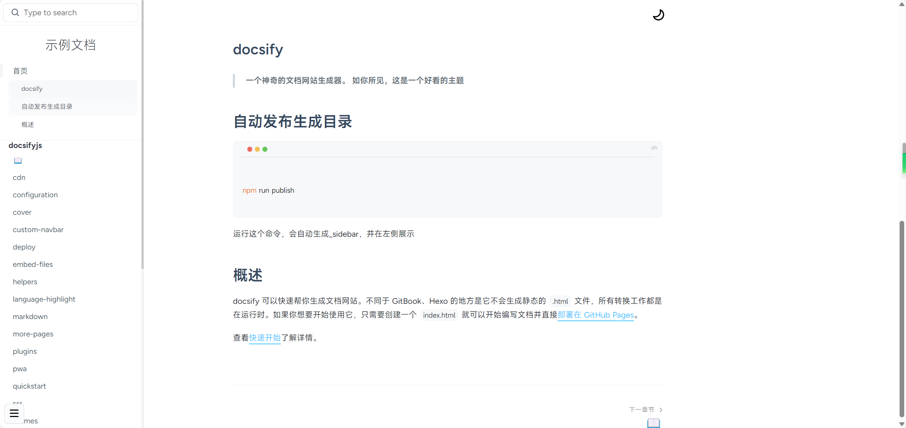

## docsify

[live-demo](https://sweetwisdom.github.io/docify-theme-nice/#/)
> 一个神奇的文档网站生成器。
>
> 开箱即用，内置搜索 目录生成插件，支持多级目录
>
> 如你所见，这是一个docsify好看的主题

## 自动发布生成目录

每次新增文件，只需要执行下面命令自动生成

```sh

npm run publish


```
运行这个命令，会自动生成_sidebar，并在左侧展示





## 主题配置

修改index.html的 `themeColor`

```js
   {
        themeColor: '#3ec4ff'
   }
```

修改其他颜色

```css
  :root {
      --dark-base-background: #27272b;
  
      --dark-base-color: #bbc0c4;
      --dark-theme-color: var(--theme-color, #42b983);
      --dark-code-color: var(--dark-base-color);
      --dark-heading-color: var(--dark-theme-color);
      --dark-cover-background: #000000a8;
      --dark-code-background: #303030;
      --dark-tip-background: transparent;
      --dark-warn-background: transparent;
      --dark-icon-size: 25px;
      --dark-icon-transition: 0.1s ease-in-out 0.1s;
      --dark-moon-color: #000000;
      --dark-sun-color: #ffffff;
    }
```


## 概述

docsify 可以快速帮你生成文档网站。不同于 GitBook、Hexo 的地方是它不会生成静态的 `.html` 文件，所有转换工作都是在运行时。如果你想要开始使用它，只需要创建一个 `index.html` 就可以开始编写文档并直接[部署在 GitHub Pages](zh-cn/deploy.md)。


## 参照

主题开发参照了：[LIGMATV/LIGMATV.github.io: Home of my open blogs 📖.](https://github.com/LIGMATV/LIGMATV.github.io),感谢大佬！

